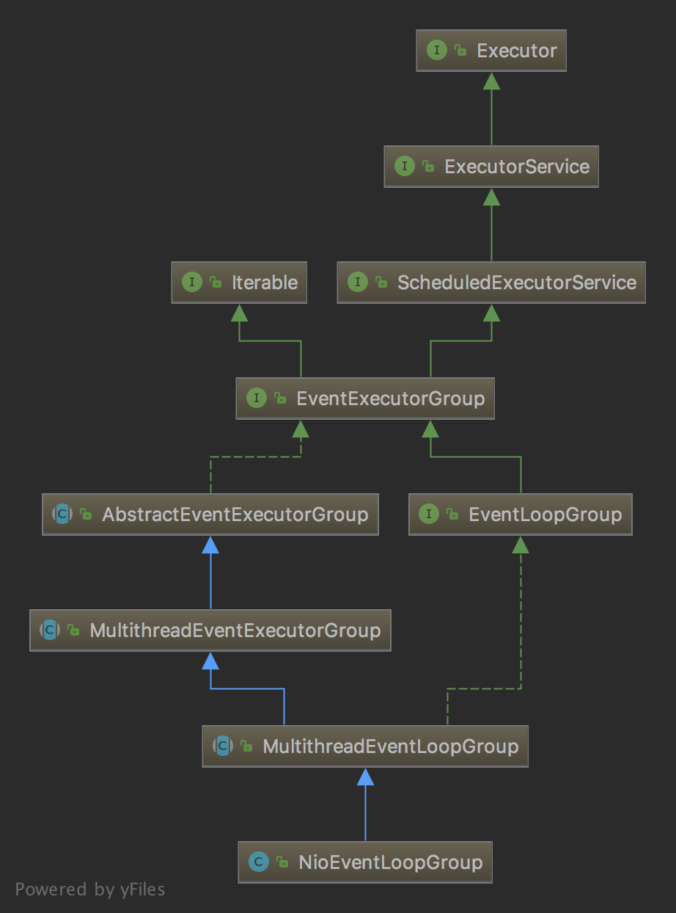
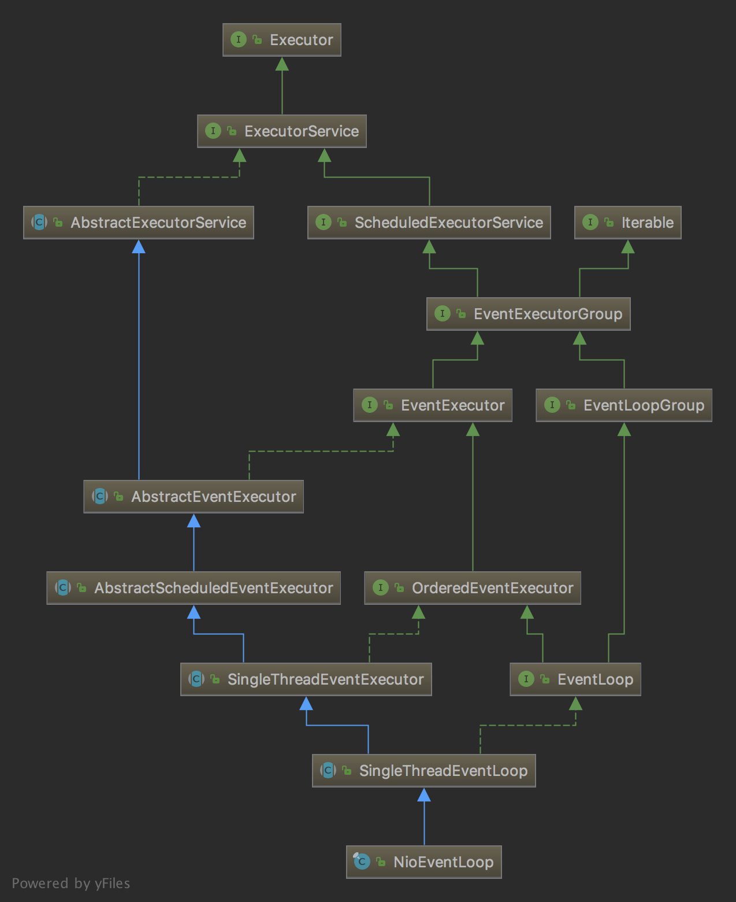

# netty example
# 构建ServerBootstrap

    //用于处理业务操作
    ExecutorService executorService = Executors.newFixedThreadPool(Runtime.getRuntime().availableProcessors() << 1);
    
    //构建ServerBootstrap实例
    ServerBootstrap bootstrap = new ServerBootstrap()
            .group(new NioEventLoopGroup(), new NioEventLoopGroup(Runtime.getRuntime().availableProcessors() << 1))
            .channel(NioServerSocketChannel.class)
            .option(ChannelOption.SO_BACKLOG, 1024)
            .childOption(ChannelOption.SO_KEEPALIVE, true)
            .childOption(ChannelOption.TCP_NODELAY, true)
            .handler(new LoggingHandler(LogLevel.DEBUG))
            .childHandler(new ChannelInitializer<NioSocketChannel>() {
                @Override
                protected void initChannel(NioSocketChannel ch) throws Exception {
                    ch.pipeline()
                            .addLast(LengthFieldBasedFrameDecoder.class.getName(), new LengthFieldBasedFrameDecoder(1024, 0, 2, 0, 2))
                            .addLast(StringDecoder.class.getName(), new StringDecoder(Charset.defaultCharset()))
                            .addLast(LengthFieldPrepender.class.getName(), new LengthFieldPrepender(2, 0))
                            .addLast(StringEncoder.class.getName(), new StringEncoder(Charset.defaultCharset()))
                            .addLast(SimpleChannelInboundHandler.class.getName(), new SimpleChannelInboundHandler<String>() {
    
                                @Override
                                protected void channelRead0(ChannelHandlerContext ctx, String msg) throws Exception {
                                    log.info("received msg: {}", msg);
                                    String result = executorService.submit(() -> {
                                        String s = new StringBuffer(msg).reverse().toString();
                                        log.info("handle msg: {}, result: {}", msg, s);
                                        return s;
                                    }).get();
                                    ctx.writeAndFlush(result)
                                            .addListener(future -> {
                                                log.info("send msg: {}", result);
                                            });
                                }
                            });
                }
            });

1. ServerBootstrap.group(EventLoopGroup parentGroup, EventLoopGroup childGroup)
    
    parentGroup处理Tcp链接请求，并将链接交给childGroup处理。
    
    childGroup处理Tcp链接上的通信，如读、写、编解码等。

2. AbstractBootstrap.channel(Class<? extends C> channelClass)

    实际上这里创建了一个ChannelFactory<? extends C>实例，也就是new ReflectiveChannelFactory<C>(channelClass)，用于后面创建NioServerSocketChannel实例。
    
    这里使用了NioServerSocketChannel.class。
    
    这里也可以调用AbstractBootstrap.channelFactory(ChannelFactory<? extends C> channelFactory)直接创建ChannelFactory<? extends C>实例。

3. AbstractBootstrap.option(ChannelOption<T> option, T value)

    设置server端的tcp参数，如ChannelOption.SO_BACKLOG，具体有哪些参数可以看ChannelOption

4. ServerBootstrap.childOption(ChannelOption<T> childOption, T value)

    设置用户客户端链接的tcp参数，如ChannelOption.SO_KEEPALIVE，具体有哪些参数可以看ChannelOption

5. AbstractBootstrap.handler(ChannelHandler handler)
    
    设置用于服务端的ChannelHandler

6. ServerBootstrap.childHandler(ChannelHandler childHandler)

    设置用于处理客户端读、写、编解码的ChannelHandler

# ServerBootstrap.group

NioEventLoopGroup、NioEventLoop

从图中可以看出，

NioEventLoopGroup实现了ScheduledExecutorService接口，即它是一个线程池。

NioEventLoop重写了AbstractExecutorService抽象类中关于线程池的方法，即它也是一个线程池。

从NioEventLoopGroup的构造器public NioEventLoopGroup(int nThreads)跟踪代码，最终会看到以下代码。

默认情况下，nThreads = cpu核心数的两倍（示例程序传入了参数，所以这里不是默认值。对于parentGroup，是1；对于childGroup，是cpu核心数左移一位），executor = null， chooserFactory = new DefaultSelectStrategyFactory()。

    protected MultithreadEventExecutorGroup(int nThreads, Executor executor,
                                            EventExecutorChooserFactory chooserFactory, Object... args) {
        if (nThreads <= 0) {
            throw new IllegalArgumentException(String.format("nThreads: %d (expected: > 0)", nThreads));
        }
        
        if (executor == null) {
            //默认情况下，创建一个没有任务队列的线程池，每次提交给它任务时，都会创建一个线程并被立即执行
            executor = new ThreadPerTaskExecutor(newDefaultThreadFactory());
        }
        //创建nThreads大小的EventExecutor数组，从后面代码可知，实际上数组元素是NioEventLoop的实例
        //NioEventLoopGroup实例内有一组NioEventLoop的实例
        children = new EventExecutor[nThreads];
    
        for (int i = 0; i < nThreads; i ++) {
            boolean success = false;
            try {
                //这里创建NioEventLoop实例
                children[i] = newChild(executor, args);
                success = true;
            } catch (Exception e) {
                // TODO: Think about if this is a good exception type
                throw new IllegalStateException("failed to create a child event loop", e);
            } finally {
                //如果EventExecutor数组未初始化成功，则逐个关闭EventExecutor
                if (!success) {
                    for (int j = 0; j < i; j ++) {
                        children[j].shutdownGracefully();
                    }
    
                    for (int j = 0; j < i; j ++) {
                        EventExecutor e = children[j];
                        try {
                            while (!e.isTerminated()) {
                                e.awaitTermination(Integer.MAX_VALUE, TimeUnit.SECONDS);
                            }
                        } catch (InterruptedException interrupted) {
                            // Let the caller handle the interruption.
                            Thread.currentThread().interrupt();
                            break;
                        }
                    }
                }
            }
        }
        //创建一个EventExecutor选择器
        chooser = chooserFactory.newChooser(children);
    
        final FutureListener<Object> terminationListener = new FutureListener<Object>() {
            @Override
            public void operationComplete(Future<Object> future) throws Exception {
                if (terminatedChildren.incrementAndGet() == children.length) {
                    terminationFuture.setSuccess(null);
                }
            }
        };
        //为EventExecutor数组中每一个NioEventLoop实例添加一个listener
        for (EventExecutor e: children) {
            e.terminationFuture().addListener(terminationListener);
        }
    
        Set<EventExecutor> childrenSet = new LinkedHashSet<EventExecutor>(children.length);
        Collections.addAll(childrenSet, children);
        readonlyChildren = Collections.unmodifiableSet(childrenSet);
    }

看一下newChild这个方法

    # NioEventLoopGroup.newChild
    @Override
    protected EventLoop newChild(Executor executor, Object... args) throws Exception {
        return new NioEventLoop(this, executor, (SelectorProvider) args[0],
            ((SelectStrategyFactory) args[1]).newSelectStrategy(), (RejectedExecutionHandler) args[2]);
    }

在NioEventLoop的构造器参数中，this = 当前正在创建的NioEventLoopGroup实例的引用，executor就是刚刚创建的ThreadPerTaskExecutor实例，后面几个参数也都是从前面传入的。

NioEventLoopGroup实例内有一组NioEventLoop的实例；而每个NioEventLoop都持有一个NioEventLoopGroup的引用。

查看NioEventLoopGroup的父类AbstractEventExecutorGroup发现，这个类实中submit、schedule、scheduleAtFixedRate、scheduleWithFixedDelay、invokeAny、invokeAny、execute方法都将通选择策略从NioEventLoop数组中选取一个元素来执行相应的任务。

NioEventLoop

    @Override
    public void execute(Runnable task) {
        if (task == null) {
            throw new NullPointerException("task");
        }

        boolean inEventLoop = inEventLoop();
        addTask(task);
        if (!inEventLoop) {
            startThread();
            if (isShutdown() && removeTask(task)) {
                reject();
            }
        }

        if (!addTaskWakesUp && wakesUpForTask(task)) {
            wakeup(inEventLoop);
        }
    }

# AbstractBootstrap.channel(Class<? extends C> channelClass)

这里会创建一个ReflectiveChannelFactory实例，对于服务端，它创建NioServerSocketChannel实例；对于客户端，它创建NioSocketChannel实例
    
# AbstractBootstrap.option(ChannelOption<T> option, T value)
# ServerBootstrap childOption(ChannelOption<T> childOption, T value)

设置ServerSocketChannel与SocketChannel的属性。

具体可以设置哪些属性，看ChannelOption类。

# AbstractBootstrap.handler(ChannelHandler handler)

用于处理ServerSocketChannel。

# ServerBootstrap.childHandler(ChannelHandler childHandler)

用于处理SocketChannel。后面详细说明这一块。

# 启动Server

# AbstractBootstrap.bind(SocketAddress localAddress)

实现两个功能

    private ChannelFuture doBind(final SocketAddress localAddress) {
        final ChannelFuture regFuture = initAndRegister();
        final Channel channel = regFuture.channel();
        if (regFuture.cause() != null) {
            return regFuture;
        }

        if (regFuture.isDone()) {
            // At this point we know that the registration was complete and successful.
            ChannelPromise promise = channel.newPromise();
            doBind0(regFuture, channel, localAddress, promise);
            return promise;
        } else {
            // Registration future is almost always fulfilled already, but just in case it's not.
            final PendingRegistrationPromise promise = new PendingRegistrationPromise(channel);
            regFuture.addListener(new ChannelFutureListener() {
                @Override
                public void operationComplete(ChannelFuture future) throws Exception {
                    Throwable cause = future.cause();
                    if (cause != null) {
                        // Registration on the EventLoop failed so fail the ChannelPromise directly to not cause an
                        // IllegalStateException once we try to access the EventLoop of the Channel.
                        promise.setFailure(cause);
                    } else {
                        // Registration was successful, so set the correct executor to use.
                        // See https://github.com/netty/netty/issues/2586
                        promise.registered();

                        doBind0(regFuture, channel, localAddress, promise);
                    }
                }
            });
            return promise;
        }
    }

该方法主要分为两个功能。

AbstractBootstrap.initAndRegister()

    final ChannelFuture initAndRegister() {
        Channel channel = null;
        try {
            //Server创建NioServerSocketChannel实例，client创建的是NioSocketChannel实例。
            channel = channelFactory.newChannel();
            //Server设置ServerSocketChannel的属性，然后将channel添加到pipeline中。
            init(channel);
        } catch (Throwable t) {
            if (channel != null) {
                // channel can be null if newChannel crashed (eg SocketException("too many open files"))
                channel.unsafe().closeForcibly();
                // as the Channel is not registered yet we need to force the usage of the GlobalEventExecutor
                return new DefaultChannelPromise(channel, GlobalEventExecutor.INSTANCE).setFailure(t);
            }
            // as the Channel is not registered yet we need to force the usage of the GlobalEventExecutor
            return new DefaultChannelPromise(new FailedChannel(), GlobalEventExecutor.INSTANCE).setFailure(t);
        }

        ChannelFuture regFuture = config().group().register(channel);
        if (regFuture.cause() != null) {
            if (channel.isRegistered()) {
                channel.close();
            } else {
                channel.unsafe().closeForcibly();
            }
        }

        // If we are here and the promise is not failed, it's one of the following cases:
        // 1) If we attempted registration from the event loop, the registration has been completed at this point.
        //    i.e. It's safe to attempt bind() or connect() now because the channel has been registered.
        // 2) If we attempted registration from the other thread, the registration request has been successfully
        //    added to the event loop's task queue for later execution.
        //    i.e. It's safe to attempt bind() or connect() now:
        //         because bind() or connect() will be executed *after* the scheduled registration task is executed
        //         because register(), bind(), and connect() are all bound to the same thread.

        return regFuture;
    }
    
# channel = channelFactory.newChannel();

这里使用反射技术调用了NioServerSocketChannel的默认构造方法

    public NioServerSocketChannel() {
        this(newSocket(DEFAULT_SELECTOR_PROVIDER));
    }

newSocket(DEFAULT_SELECTOR_PROVIDER)返回了一个Java Nio的ServerSocketChannel实例。

继续往深挖

    public NioServerSocketChannel(ServerSocketChannel channel) {
        super(null, channel, SelectionKey.OP_ACCEPT);
        config = new NioServerSocketChannelConfig(this, javaChannel().socket());
    }

这里的ServerSocketChannel就是Java NIO的ServerSocketChannel。创建了一个NioServerSocketChannelConfig，将netty的NioServerSocketChannel实例与java的ServerSocket包装进去。

再挖，看super(null, channel, SelectionKey.OP_ACCEPT);

这里parent == null，readInterestOp == SelectionKey.OP_ACCEPT。然后配置ServerSocketChannel为非阻塞。

    protected AbstractNioChannel(Channel parent, SelectableChannel ch, int readInterestOp) {
        super(parent);
        this.ch = ch;
        this.readInterestOp = readInterestOp;
        try {
            ch.configureBlocking(false);
        } catch (IOException e) {
            try {
                ch.close();
            } catch (IOException e2) {
                if (logger.isWarnEnabled()) {
                    logger.warn(
                            "Failed to close a partially initialized socket.", e2);
                }
            }

            throw new ChannelException("Failed to enter non-blocking mode.", e);
        }
    }

还挖，看super(parent);，这里创建了NioMessageUnsafe实例、DefaultChannelPipeline实例、ChannelId实例。并且DefaultChannelPipeline通过持有一个当前所创建的channel引用进行关联，也就是channel和pipeline是互相持有的。
实质上DefaultChannelPipeline是一个双向链表，链表元素是AbstractChannelHandlerContext的实例。

    protected AbstractChannel(Channel parent) {
        this.parent = parent;
        id = newId();
        unsafe = newUnsafe();
        pipeline = newChannelPipeline();
    }

    protected DefaultChannelPipeline(Channel channel) {
        this.channel = ObjectUtil.checkNotNull(channel, "channel");
        succeededFuture = new SucceededChannelFuture(channel, null);
        voidPromise =  new VoidChannelPromise(channel, true);

        tail = new TailContext(this);
        head = new HeadContext(this);

        head.next = tail;
        tail.prev = head;
    }

    final class TailContext extends AbstractChannelHandlerContext implements ChannelInboundHandler {

        TailContext(DefaultChannelPipeline pipeline) {
            super(pipeline, null, TAIL_NAME, true, false);
            setAddComplete();
        }
        ...
    }    

    final class HeadContext extends AbstractChannelHandlerContext
            implements ChannelOutboundHandler, ChannelInboundHandler {

        private final Unsafe unsafe;

        HeadContext(DefaultChannelPipeline pipeline) {
            super(pipeline, null, HEAD_NAME, false, true);
            unsafe = pipeline.channel().unsafe();
            setAddComplete();
        }
        ...
    }    

HeadContext、TailContext都继承了AbstractChannelHandlerContext。

HeadContext是outbound的。TailContext是inbound的。

AbstractChannelHandlerContext是一个双向链表，DefaultChannelPipeline持有双向链表的头节点、尾节点。

# ServerBootstrap.init(channel);

    @Override
    void init(Channel channel) throws Exception {
        final Map<ChannelOption<?>, Object> options = options0();
        synchronized (options) {
            setChannelOptions(channel, options, logger);
        }

        final Map<AttributeKey<?>, Object> attrs = attrs0();
        synchronized (attrs) {
            for (Entry<AttributeKey<?>, Object> e: attrs.entrySet()) {
                @SuppressWarnings("unchecked")
                AttributeKey<Object> key = (AttributeKey<Object>) e.getKey();
                channel.attr(key).set(e.getValue());
            }
        }

        ChannelPipeline p = channel.pipeline();

        final EventLoopGroup currentChildGroup = childGroup;
        final ChannelHandler currentChildHandler = childHandler;
        final Entry<ChannelOption<?>, Object>[] currentChildOptions;
        final Entry<AttributeKey<?>, Object>[] currentChildAttrs;
        synchronized (childOptions) {
            currentChildOptions = childOptions.entrySet().toArray(newOptionArray(0));
        }
        synchronized (childAttrs) {
            currentChildAttrs = childAttrs.entrySet().toArray(newAttrArray(0));
        }

        // 1
        p.addLast(new ChannelInitializer<Channel>() {
            @Override
            public void initChannel(final Channel ch) throws Exception {
                final ChannelPipeline pipeline = ch.pipeline();
                ChannelHandler handler = config.handler();
                if (handler != null) {
                    // 2
                    pipeline.addLast(handler);
                }

                ch.eventLoop().execute(new Runnable() {
                    @Override
                    public void run() {
                        // 3
                        pipeline.addLast(new ServerBootstrapAcceptor(
                                ch, currentChildGroup, currentChildHandler, currentChildOptions, currentChildAttrs));
                    }
                });
            }
        });
    }

1. 设置NioServerSocketChannel的TCP属性。
2. 向NioServerSocketChannel的pipeline添加handler、childHandler

1处的addLast
    
    @Override
    public final ChannelPipeline addLast(EventExecutorGroup group, String name, ChannelHandler handler) {
        final AbstractChannelHandlerContext newCtx;
        synchronized (this) {
            checkMultiplicity(handler);
            //创建DefaultChannelHandlerContext实例，并将handler、pipeline与其相关联，即它持有了当前添加的handler以及当前pipeline的引用
            newCtx = newContext(group, filterName(name, handler), handler);

            //将刚创建的context添加到双向链表的尾节点之前
            addLast0(newCtx);

            // If the registered is false it means that the channel was not registered on an eventloop yet.
            // In this case we add the context to the pipeline and add a task that will call
            // ChannelHandler.handlerAdded(...) once the channel is registered.
            if (!registered) {
                newCtx.setAddPending();
                // 第一次调用时registered = false，初始化pendingHandlerCallbackHead属性，即在这里会创建PendingHandlerAddedTask实例，pendingHandlerCallbackHead是一个链表，如果后续还有调用到这里，会在链表尾部追加元素
                // 所以这里就返回了，2、3处对addLast方法的调用也没有在这里执行
                callHandlerCallbackLater(newCtx, true);
                return this;
            }

            EventExecutor executor = newCtx.executor();
            if (!executor.inEventLoop()) {
                newCtx.setAddPending();
                executor.execute(new Runnable() {
                    @Override
                    public void run() {
                        //这里调用ChannelInitializer的initChannel方法，它将AbstractBootstrap.handler(ChannelHandler handler)的handler添加到pipeline，然后将ChannelInitializer实例从pipeline中移除
                        callHandlerAdded0(newCtx);
                    }
                });
                return this;
            }
        }
        //这里调用ChannelInitializer的initChannel方法，它将AbstractBootstrap.handler(ChannelHandler handler)的handler添加到pipeline，然后将ChannelInitializer实例从pipeline中移除
        callHandlerAdded0(newCtx);
        return this;
    }

这里创建了DefaultChannelHandlerContext实例，并将该实例添加到context双向链表的尾节点tail节点之前。该实例持有ChannelPipeline的实例引用、Channel实例引用。
然后调用callHandlerAdded0方法，这里会调用之前的initChannel方法。

2处的addLast

3处的addLast

将ServerBootstrapAcceptor添加到pipeline。它继承了ChannelInboundHandlerAdapter，包装了通过ServerBootstrap添加的channel、childGroup、childHandler、childOptions、childAttrs，并且添加了一个任务在异常时重新设置channel的config的autoRead属性。

    @Override
    public ChannelConfig setAutoRead(boolean autoRead) {
        boolean oldAutoRead = AUTOREAD_UPDATER.getAndSet(this, autoRead ? 1 : 0) == 1;
        if (autoRead && !oldAutoRead) {
            channel.read();
        } else if (!autoRead && oldAutoRead) {
            autoReadCleared();
        }
        return this;
    }

# ChannelFuture regFuture = config().group().register(channel);

这里的group就是parentGroup。

eventLoop就是从parentGroup的EventExecutor数组中选取的其中一个。

    @Override
    public final void register(EventLoop eventLoop, final ChannelPromise promise) {
        if (eventLoop == null) {
            throw new NullPointerException("eventLoop");
        }
        if (isRegistered()) {
            promise.setFailure(new IllegalStateException("registered to an event loop already"));
            return;
        }
        if (!isCompatible(eventLoop)) {
            promise.setFailure(
                    new IllegalStateException("incompatible event loop type: " + eventLoop.getClass().getName()));
            return;
        }
        
        // 给channel的eventLoop赋值，即将该eventLoop绑定到了channel上
        AbstractChannel.this.eventLoop = eventLoop;
        
        //currentTHread = main，NioEventLoop.thread = null，所以走else分枝
        if (eventLoop.inEventLoop()) {
            register0(promise);
        } else {
            try {
                eventLoop.execute(new Runnable() {
                    @Override
                    public void run() {
                        register0(promise);
                    }
                });
            } catch (Throwable t) {
                logger.warn(
                        "Force-closing a channel whose registration task was not accepted by an event loop: {}",
                        AbstractChannel.this, t);
                closeForcibly();
                closeFuture.setClosed();
                safeSetFailure(promise, t);
            }
        }

NioEventLoop的execute方法，将task添加到任务队列

    @Override
    public void execute(Runnable task) {
        if (task == null) {
            throw new NullPointerException("task");
        }
        // currentTHread = main，NioEventLoop.thread = null，false
        boolean inEventLoop = inEventLoop();
        // 将任务添加到队列
        addTask(task);
        if (!inEventLoop) {
            //这里会给NioEventLoop.thread赋值，并调用NioEventLoop的run方法
            startThread();
            if (isShutdown() && removeTask(task)) {
                reject();
            }
        }

        if (!addTaskWakesUp && wakesUpForTask(task)) {
            wakeup(inEventLoop);
        }
    }

    private void startThread() {
        if (state == ST_NOT_STARTED) {
            if (STATE_UPDATER.compareAndSet(this, ST_NOT_STARTED, ST_STARTED)) {
                try {
                    doStartThread();
                } catch (Throwable cause) {
                    STATE_UPDATER.set(this, ST_NOT_STARTED);
                    PlatformDependent.throwException(cause);
                }
            }
        }
    }

    private void doStartThread() {
        assert thread == null;
        //这里的executor就是构建NioEventLoopGroup时创建的那个没有任务队列的线程池，提交一个任务就开启一个线程
        executor.execute(new Runnable() {
            @Override
            public void run() {
                // 给thread属性赋值，之后eventLoop.inEventLoop()就应该是true了
                thread = Thread.currentThread();
                if (interrupted) {
                    thread.interrupt();
                }

                boolean success = false;
                updateLastExecutionTime();
                try {
                    SingleThreadEventExecutor.this.run();
                    success = true;
                } catch (Throwable t) {
                    logger.warn("Unexpected exception from an event executor: ", t);
                } finally {
                    for (;;) {
                        int oldState = state;
                        if (oldState >= ST_SHUTTING_DOWN || STATE_UPDATER.compareAndSet(
                                SingleThreadEventExecutor.this, oldState, ST_SHUTTING_DOWN)) {
                            break;
                        }
                    }

                    // Check if confirmShutdown() was called at the end of the loop.
                    if (success && gracefulShutdownStartTime == 0) {
                        if (logger.isErrorEnabled()) {
                            logger.error("Buggy " + EventExecutor.class.getSimpleName() + " implementation; " +
                                    SingleThreadEventExecutor.class.getSimpleName() + ".confirmShutdown() must " +
                                    "be called before run() implementation terminates.");
                        }
                    }

                    try {
                        // Run all remaining tasks and shutdown hooks.
                        for (;;) {
                            if (confirmShutdown()) {
                                break;
                            }
                        }
                    } finally {
                        try {
                            cleanup();
                        } finally {
                            STATE_UPDATER.set(SingleThreadEventExecutor.this, ST_TERMINATED);
                            threadLock.release();
                            if (!taskQueue.isEmpty()) {
                                if (logger.isWarnEnabled()) {
                                    logger.warn("An event executor terminated with " +
                                            "non-empty task queue (" + taskQueue.size() + ')');
                                }
                            }

                            terminationFuture.setSuccess(null);
                        }
                    }
                }
            }
        });
    }

调用了NioEventLoop的run方法，用于nio的事件处理

    @Override
    protected void run() {
        for (;;) {
            try {
                switch (selectStrategy.calculateStrategy(selectNowSupplier, hasTasks())) {
                    case SelectStrategy.CONTINUE:
                        continue;

                    case SelectStrategy.BUSY_WAIT:
                        // fall-through to SELECT since the busy-wait is not supported with NIO

                    case SelectStrategy.SELECT:
                        select(wakenUp.getAndSet(false));

                        // 'wakenUp.compareAndSet(false, true)' is always evaluated
                        // before calling 'selector.wakeup()' to reduce the wake-up
                        // overhead. (Selector.wakeup() is an expensive operation.)
                        //
                        // However, there is a race condition in this approach.
                        // The race condition is triggered when 'wakenUp' is set to
                        // true too early.
                        //
                        // 'wakenUp' is set to true too early if:
                        // 1) Selector is waken up between 'wakenUp.set(false)' and
                        //    'selector.select(...)'. (BAD)
                        // 2) Selector is waken up between 'selector.select(...)' and
                        //    'if (wakenUp.get()) { ... }'. (OK)
                        //
                        // In the first case, 'wakenUp' is set to true and the
                        // following 'selector.select(...)' will wake up immediately.
                        // Until 'wakenUp' is set to false again in the next round,
                        // 'wakenUp.compareAndSet(false, true)' will fail, and therefore
                        // any attempt to wake up the Selector will fail, too, causing
                        // the following 'selector.select(...)' call to block
                        // unnecessarily.
                        //
                        // To fix this problem, we wake up the selector again if wakenUp
                        // is true immediately after selector.select(...).
                        // It is inefficient in that it wakes up the selector for both
                        // the first case (BAD - wake-up required) and the second case
                        // (OK - no wake-up required).

                        if (wakenUp.get()) {
                            selector.wakeup();
                        }
                        // fall through
                    default:
                }

                cancelledKeys = 0;
                needsToSelectAgain = false;
                final int ioRatio = this.ioRatio;
                if (ioRatio == 100) {
                    try {
                        //处理nio事件
                        processSelectedKeys();
                    } finally {
                        // 执行所有已提交的task，前面else分枝添加的任务会在这里被执行
                        // Ensure we always run tasks.
                        runAllTasks();
                    }
                } else {
                    final long ioStartTime = System.nanoTime();
                    try {
                        //处理nio事件
                        processSelectedKeys();
                    } finally {
                        // 执行所有已提交的task，前面else分枝添加的任务会在这里被执行
                        // Ensure we always run tasks.
                        final long ioTime = System.nanoTime() - ioStartTime;
                        runAllTasks(ioTime * (100 - ioRatio) / ioRatio);
                    }
                }
            } catch (Throwable t) {
                handleLoopException(t);
            }
            // Always handle shutdown even if the loop processing threw an exception.
            try {
                if (isShuttingDown()) {
                    closeAll();
                    if (confirmShutdown()) {
                        return;
                    }
                }
            } catch (Throwable t) {
                handleLoopException(t);
            }
        }
    }

上面这块代码会执行刚才添加的任务，即register0方法。

     private void register0(ChannelPromise promise) {
         try {
             // check if the channel is still open as it could be closed in the mean time when the register
             // call was outside of the eventLoop
             if (!promise.setUncancellable() || !ensureOpen(promise)) {
                 return;
             }
             boolean firstRegistration = neverRegistered;
             // 监听tcp读事件？？?
             doRegister();
             neverRegistered = false;
             registered = true;

             // Ensure we call handlerAdded(...) before we actually notify the promise. This is needed as the
             // user may already fire events through the pipeline in the ChannelFutureListener.
             
             pipeline.invokeHandlerAddedIfNeeded();

             safeSetSuccess(promise);
             pipeline.fireChannelRegistered();
             // Only fire a channelActive if the channel has never been registered. This prevents firing
             // multiple channel actives if the channel is deregistered and re-registered.
             if (isActive()) {
                 if (firstRegistration) {
                     pipeline.fireChannelActive();
                 } else if (config().isAutoRead()) {
                     // This channel was registered before and autoRead() is set. This means we need to begin read
                     // again so that we process inbound data.
                     //
                     // See https://github.com/netty/netty/issues/4805
                     beginRead();
                 }
             }
         } catch (Throwable t) {
             // Close the channel directly to avoid FD leak.
             closeForcibly();
             closeFuture.setClosed();
             safeSetFailure(promise, t);
         }
     }
     
    @Override
    protected void doRegister() throws Exception {
        boolean selected = false;
        for (;;) {
            try {
                selectionKey = javaChannel().register(eventLoop().unwrappedSelector(), 0, this);
                return;
            } catch (CancelledKeyException e) {
                if (!selected) {
                    // Force the Selector to select now as the "canceled" SelectionKey may still be
                    // cached and not removed because no Select.select(..) operation was called yet.
                    eventLoop().selectNow();
                    selected = true;
                } else {
                    // We forced a select operation on the selector before but the SelectionKey is still cached
                    // for whatever reason. JDK bug ?
                    throw e;
                }
            }
        }
    }

这里就开始监听TCP 读 事件了。？？？

pipeline.invokeHandlerAddedIfNeeded();

    final void invokeHandlerAddedIfNeeded() {
        assert channel.eventLoop().inEventLoop();
        if (firstRegistration) {
            firstRegistration = false;
            // We are now registered to the EventLoop. It's time to call the callbacks for the ChannelHandlers,
            // that were added before the registration was done.
            callHandlerAddedForAllHandlers();
        }
    }
    
firstRegistration 默认值true，然后更新为false，也就是只有在第一次调用register0时才会执行callHandlerAddedForAllHandlers方法。callHandlerAddedForAllHandlers就是在执行刚才在addLast方法中创建的pendingHandlerCallbackHead链表中的任务了。

    private void callHandlerAddedForAllHandlers() {
        final PendingHandlerCallback pendingHandlerCallbackHead;
        synchronized (this) {
            assert !registered;

            // This Channel itself was registered.
            registered = true;

            pendingHandlerCallbackHead = this.pendingHandlerCallbackHead;
            // Null out so it can be GC'ed.
            this.pendingHandlerCallbackHead = null;
        }

        // This must happen outside of the synchronized(...) block as otherwise handlerAdded(...) may be called while
        // holding the lock and so produce a deadlock if handlerAdded(...) will try to add another handler from outside
        // the EventLoop.
        PendingHandlerCallback task = pendingHandlerCallbackHead;
        while (task != null) {
            task.execute();
            task = task.next;
        }
    }
 
看看这些任务在干啥，实际上还是调用的callHandlerAdded0方法

    private final class PendingHandlerAddedTask extends PendingHandlerCallback {

        PendingHandlerAddedTask(AbstractChannelHandlerContext ctx) {
            super(ctx);
        }

        @Override
        public void run() {
            callHandlerAdded0(ctx);
        }

        @Override
        void execute() {
            EventExecutor executor = ctx.executor();
            // executor.inEventLoop() = true
            if (executor.inEventLoop()) {
                callHandlerAdded0(ctx);
            } else {
                try {
                    executor.execute(this);
                } catch (RejectedExecutionException e) {
                    if (logger.isWarnEnabled()) {
                        logger.warn(
                                "Can't invoke handlerAdded() as the EventExecutor {} rejected it, removing handler {}.",
                                executor, ctx.name(), e);
                    }
                    remove0(ctx);
                    ctx.setRemoved();
                }
            }
        }
    }
 
io.netty.channel.DefaultChannelPipeline.callHandlerAdded0

     private void callHandlerAdded0(final AbstractChannelHandlerContext ctx) {
         try {
             // We must call setAddComplete before calling handlerAdded. Otherwise if the handlerAdded method generates
             // any pipeline events ctx.handler() will miss them because the state will not allow it.
             ctx.setAddComplete();
             ctx.handler().handlerAdded(ctx);
         } catch (Throwable t) {
             boolean removed = false;
             try {
                 remove0(ctx);
                 try {
                     ctx.handler().handlerRemoved(ctx);
                 } finally {
                     ctx.setRemoved();
                 }
                 removed = true;
             } catch (Throwable t2) {
                 if (logger.isWarnEnabled()) {
                     logger.warn("Failed to remove a handler: " + ctx.name(), t2);
                 }
             }
 
             if (removed) {
                 fireExceptionCaught(new ChannelPipelineException(
                         ctx.handler().getClass().getName() +
                         ".handlerAdded() has thrown an exception; removed.", t));
             } else {
                 fireExceptionCaught(new ChannelPipelineException(
                         ctx.handler().getClass().getName() +
                         ".handlerAdded() has thrown an exception; also failed to remove.", t));
             }
         }
     }

这里的ctx 就是刚才创建的newCtx，handler是1处的ChannelInitializer实例，看看ChannelInitializer的handlerAdded方法

    @Override
    public void handlerAdded(ChannelHandlerContext ctx) throws Exception {
        if (ctx.channel().isRegistered()) {
            // This should always be true with our current DefaultChannelPipeline implementation.
            // The good thing about calling initChannel(...) in handlerAdded(...) is that there will be no ordering
            // surprises if a ChannelInitializer will add another ChannelInitializer. This is as all handlers
            // will be added in the expected order.
            initChannel(ctx);
        }
    }

    @SuppressWarnings("unchecked")
    private boolean initChannel(ChannelHandlerContext ctx) throws Exception {
        if (initMap.putIfAbsent(ctx, Boolean.TRUE) == null) { // Guard against re-entrance.
            try {
                initChannel((C) ctx.channel());
            } catch (Throwable cause) {
                // Explicitly call exceptionCaught(...) as we removed the handler before calling initChannel(...).
                // We do so to prevent multiple calls to initChannel(...).
                exceptionCaught(ctx, cause);
            } finally {
                remove(ctx);
            }
            return true;
        }
        return false;
    }

调用了ChannelInitializer实例的initChannel方法，该方法以构建ServerBootstrap时传入的handler为参数再一次调用了addLast方法。然后在finally中将ctx从pipeline移除。也就是ChannelInitializer的context不会在pipeline中保留。

    @Override
    public final ChannelPipeline addLast(EventExecutorGroup group, String name, ChannelHandler handler) {
        final AbstractChannelHandlerContext newCtx;
        synchronized (this) {
            checkMultiplicity(handler);
            //创建DefaultChannelHandlerContext实例，并将handler、pipeline与其相关联，即它持有了当前添加的handler以及当前pipeline的引用
            newCtx = newContext(group, filterName(name, handler), handler);

            //将刚创建的context添加到双向链表的尾节点之前
            addLast0(newCtx);

            // If the registered is false it means that the channel was not registered on an eventloop yet.
            // In this case we add the context to the pipeline and add a task that will call
            // ChannelHandler.handlerAdded(...) once the channel is registered.
            // registered = true
            if (!registered) {
                newCtx.setAddPending();
                // 第一次调用时registered = false，初始化pendingHandlerCallbackHead属性，即在这里会创建PendingHandlerAddedTask实例，pendingHandlerCallbackHead是一个链表，如果后续还有调用到这里，会在链表尾部追加元素
                // 所以这里就返回了，2、3处对addLast方法的调用也没有在这里执行
                callHandlerCallbackLater(newCtx, true);
                return this;
            }

            // 
            EventExecutor executor = newCtx.executor();
            if (!executor.inEventLoop()) {// executor.inEventLoop() = true，所以也不会走这里
                newCtx.setAddPending();
                executor.execute(new Runnable() {
                    @Override
                    public void run() {
                        //这里调用ChannelInitializer的initChannel方法，它将AbstractBootstrap.handler(ChannelHandler handler)的handler添加到pipeline，然后将ChannelInitializer实例从pipeline中移除
                        callHandlerAdded0(newCtx);
                    }
                });
                return this;
            }
        }
        // 实际上只添加了一个LoggingHandler，它的handlerAdded也没做什么事情
        callHandlerAdded0(newCtx);
        return this;
    }

到这里server端的handler已经被添加到pipeline中了。

在来看看childHandler是怎么添加到pipeline的。

    ch.eventLoop().execute(new Runnable() {
        @Override
        public void run() {
            pipeline.addLast(new ServerBootstrapAcceptor(
                    ch, currentChildGroup, currentChildHandler, currentChildOptions, currentChildAttrs));
        }
    });
    
ServerBootstrapAcceptor实例的context被添加到双向链表尾节点的前面。

双向链表现在有四个节点，head、logging、acceptor、tail。所有

# AbstractBootstrap.doBind0(regFuture, channel, localAddress, promise);

AbstractBootstrap.doBind0

    private static void doBind0(
            final ChannelFuture regFuture, final Channel channel,
            final SocketAddress localAddress, final ChannelPromise promise) {

        // This method is invoked before channelRegistered() is triggered.  Give user handlers a chance to set up
        // the pipeline in its channelRegistered() implementation.
        channel.eventLoop().execute(new Runnable() {
            @Override
            public void run() {
                if (regFuture.isSuccess()) {
                    channel.bind(localAddress, promise).addListener(ChannelFutureListener.CLOSE_ON_FAILURE);
                } else {
                    promise.setFailure(regFuture.cause());
                }
            }
        });
    }

AbstractChannel.bind(java.net.SocketAddress, io.netty.channel.ChannelPromise)

channel.bind(localAddress, promise).addListener(ChannelFutureListener.CLOSE_ON_FAILURE);
这里的channel是前面创建的NioServerSocketChannel实例。

    @Override
    public ChannelFuture bind(SocketAddress localAddress, ChannelPromise promise) {
        return pipeline.bind(localAddress, promise);
    }

io.netty.channel.DefaultChannelPipeline.bind(java.net.SocketAddress, io.netty.channel.ChannelPromise)

    @Override
    public final ChannelFuture bind(SocketAddress localAddress, ChannelPromise promise) {
        return tail.bind(localAddress, promise);
    }

tail是DefaultChannelPipeline的一个属性，是双向链表的尾节点，在实例化DefaultChannelPipeline时已被赋值。

    tail = new TailContext(this);

io.netty.channel.AbstractChannelHandlerContext.bind(java.net.SocketAddress, io.netty.channel.ChannelPromise)

    @Override
    public ChannelFuture bind(final SocketAddress localAddress, final ChannelPromise promise) {
        if (localAddress == null) {
            throw new NullPointerException("localAddress");
        }
        if (isNotValidPromise(promise, false)) {
            // cancelled
            return promise;
        }

        final AbstractChannelHandlerContext next = findContextOutbound();
        EventExecutor executor = next.executor();
        if (executor.inEventLoop()) {
            next.invokeBind(localAddress, promise);
        } else {
            safeExecute(executor, new Runnable() {
                @Override
                public void run() {
                    next.invokeBind(localAddress, promise);
                }
            }, promise, null);
        }
        return promise;
    }

它从尾节点tail开始向前遍历双向链表，找到第一个不是outbound的context并调用它的invokeBind方法。由于用于处理服务端的handler只有一个LoggingHandler，它既是outbound的、又是inbound的，所以这里会后调用LoggingHandler的context的invokeBind方法，由前面可知，head也是outbound的，然后继续调用head的bind方法。
依次调用acceptor、logging、head的invokeBind

HeadContext.bind(ChannelHandlerContext ctx, SocketAddress localAddress, ChannelPromise promise)

    @Override
    public void bind(
            ChannelHandlerContext ctx, SocketAddress localAddress, ChannelPromise promise)
            throws Exception {
        unsafe.bind(localAddress, promise);
    }

AbstractChannel.AbstractUnsafe.bind(final SocketAddress localAddress, final ChannelPromise promise)

    @Override
    public final void bind(final SocketAddress localAddress, final ChannelPromise promise) {
        assertEventLoop();

        if (!promise.setUncancellable() || !ensureOpen(promise)) {
            return;
        }

        // See: https://github.com/netty/netty/issues/576
        if (Boolean.TRUE.equals(config().getOption(ChannelOption.SO_BROADCAST)) &&
            localAddress instanceof InetSocketAddress &&
            !((InetSocketAddress) localAddress).getAddress().isAnyLocalAddress() &&
            !PlatformDependent.isWindows() && !PlatformDependent.maybeSuperUser()) {
            // Warn a user about the fact that a non-root user can't receive a
            // broadcast packet on *nix if the socket is bound on non-wildcard address.
            logger.warn(
                    "A non-root user can't receive a broadcast packet if the socket " +
                    "is not bound to a wildcard address; binding to a non-wildcard " +
                    "address (" + localAddress + ") anyway as requested.");
        }

        boolean wasActive = isActive();
        try {
            doBind(localAddress);
        } catch (Throwable t) {
            safeSetFailure(promise, t);
            closeIfClosed();
            return;
        }

        if (!wasActive && isActive()) {
            invokeLater(new Runnable() {
                @Override
                public void run() {
                    pipeline.fireChannelActive();
                }
            });
        }

        safeSetSuccess(promise);
    }

NioServerSocketChannel.doBind(SocketAddress localAddress)

    protected void doBind(SocketAddress localAddress) throws Exception {
        if (PlatformDependent.javaVersion() >= 7) {
            javaChannel().bind(localAddress, config.getBacklog());
        } else {
            javaChannel().socket().bind(localAddress, config.getBacklog());
        }
    }

到这里，javaChannel已经跟localAddress进行了绑定。

再来看，pipeline.fireChannelActive();

    @Override
    public final ChannelPipeline fireChannelActive() {
        AbstractChannelHandlerContext.invokeChannelActive(head);
        return this;
    }

它调用了head节点的channelActive方法。

    @Override
    public void channelActive(ChannelHandlerContext ctx) throws Exception {
        ctx.fireChannelActive();

        readIfIsAutoRead();
    }
    
看看readIfIsAutoRead方法。

io.netty.channel.DefaultChannelPipeline.HeadContext.readIfIsAutoRead

    private void readIfIsAutoRead() {
        if (channel.config().isAutoRead()) {
            channel.read();
        }
    }

io.netty.channel.AbstractChannel.read
   
    @Override
    public Channel read() {
        pipeline.read();
        return this;
    }

io.netty.channel.DefaultChannelPipeline.read

    @Override
    public final ChannelPipeline read() {
        tail.read();
        return this;
    }

这里调用了tail节点的read方法。

AbstractChannelHandlerContext.read

    @Override
    public ChannelHandlerContext read() {
        final AbstractChannelHandlerContext next = findContextOutbound();
        EventExecutor executor = next.executor();
        if (executor.inEventLoop()) {
            next.invokeRead();
        } else {
            Runnable task = next.invokeReadTask;
            if (task == null) {
                next.invokeReadTask = task = new Runnable() {
                    @Override
                    public void run() {
                        next.invokeRead();
                    }
                };
            }
            executor.execute(task);
        }

        return this;
    }

再到head节点的read方法

io.netty.channel.DefaultChannelPipeline.HeadContext.read

    @Override
    public void read(ChannelHandlerContext ctx) {
        unsafe.beginRead();
    }

io.netty.channel.AbstractChannel.AbstractUnsafe.beginRead

    @Override
    public final void beginRead() {
        assertEventLoop();

        if (!isActive()) {
            return;
        }

        try {
            doBeginRead();
        } catch (final Exception e) {
            invokeLater(new Runnable() {
                @Override
                public void run() {
                    pipeline.fireExceptionCaught(e);
                }
            });
            close(voidPromise());
        }
    }
    

io.netty.channel.nio.AbstractNioChannel.doBeginRead

    @Override
    protected void doBeginRead() throws Exception {
        // Channel.read() or ChannelHandlerContext.read() was called
        final SelectionKey selectionKey = this.selectionKey;
        if (!selectionKey.isValid()) {
            return;
        }

        readPending = true;

        final int interestOps = selectionKey.interestOps();
        if ((interestOps & readInterestOp) == 0) {
            selectionKey.interestOps(interestOps | readInterestOp);
        }
    }

这里interestOps=0，readInterestOp=OP_ACCEPT，所以这里注册了OP_ACCEPT事件。

# processSelectedKeys

NioEventLoop的run方法调用了这个方法。

    private void processSelectedKeys() {
        if (selectedKeys != null) {
            processSelectedKeysOptimized();
        } else {
            processSelectedKeysPlain(selector.selectedKeys());
        }
    }

    private void processSelectedKeysOptimized() {
        for (int i = 0; i < selectedKeys.size; ++i) {
            final SelectionKey k = selectedKeys.keys[i];
            // null out entry in the array to allow to have it GC'ed once the Channel close
            // See https://github.com/netty/netty/issues/2363
            selectedKeys.keys[i] = null;

            final Object a = k.attachment();

            if (a instanceof AbstractNioChannel) {
                processSelectedKey(k, (AbstractNioChannel) a);
            } else {
                @SuppressWarnings("unchecked")
                NioTask<SelectableChannel> task = (NioTask<SelectableChannel>) a;
                processSelectedKey(k, task);
            }

            if (needsToSelectAgain) {
                // null out entries in the array to allow to have it GC'ed once the Channel close
                // See https://github.com/netty/netty/issues/2363
                selectedKeys.reset(i + 1);

                selectAgain();
                i = -1;
            }
        }
    }

processSelectedKey(k, (AbstractNioChannel) a);

    private void processSelectedKey(SelectionKey k, AbstractNioChannel ch) {
        final AbstractNioChannel.NioUnsafe unsafe = ch.unsafe();
        if (!k.isValid()) {
            final EventLoop eventLoop;
            try {
                eventLoop = ch.eventLoop();
            } catch (Throwable ignored) {
                // If the channel implementation throws an exception because there is no event loop, we ignore this
                // because we are only trying to determine if ch is registered to this event loop and thus has authority
                // to close ch.
                return;
            }
            // Only close ch if ch is still registered to this EventLoop. ch could have deregistered from the event loop
            // and thus the SelectionKey could be cancelled as part of the deregistration process, but the channel is
            // still healthy and should not be closed.
            // See https://github.com/netty/netty/issues/5125
            if (eventLoop != this || eventLoop == null) {
                return;
            }
            // close the channel if the key is not valid anymore
            unsafe.close(unsafe.voidPromise());
            return;
        }

        try {
            int readyOps = k.readyOps();
            // We first need to call finishConnect() before try to trigger a read(...) or write(...) as otherwise
            // the NIO JDK channel implementation may throw a NotYetConnectedException.
            if ((readyOps & SelectionKey.OP_CONNECT) != 0) {
                // remove OP_CONNECT as otherwise Selector.select(..) will always return without blocking
                // See https://github.com/netty/netty/issues/924
                int ops = k.interestOps();
                ops &= ~SelectionKey.OP_CONNECT;
                k.interestOps(ops);

                unsafe.finishConnect();
            }

            // Process OP_WRITE first as we may be able to write some queued buffers and so free memory.
            if ((readyOps & SelectionKey.OP_WRITE) != 0) {
                // Call forceFlush which will also take care of clear the OP_WRITE once there is nothing left to write
                ch.unsafe().forceFlush();
            }

            // Also check for readOps of 0 to workaround possible JDK bug which may otherwise lead
            // to a spin loop
            if ((readyOps & (SelectionKey.OP_READ | SelectionKey.OP_ACCEPT)) != 0 || readyOps == 0) {
                unsafe.read();
            }
        } catch (CancelledKeyException ignored) {
            unsafe.close(unsafe.voidPromise());
        }
    }

当有OP_ACCEPT事件时调用了unsafe.read();

        public void read() {
            assert eventLoop().inEventLoop();
            final ChannelConfig config = config();
            final ChannelPipeline pipeline = pipeline();
            final RecvByteBufAllocator.Handle allocHandle = unsafe().recvBufAllocHandle();
            allocHandle.reset(config);

            boolean closed = false;
            Throwable exception = null;
            try {
                try {
                    do {
                        int localRead = doReadMessages(readBuf);
                        if (localRead == 0) {
                            break;
                        }
                        if (localRead < 0) {
                            closed = true;
                            break;
                        }

                        allocHandle.incMessagesRead(localRead);
                    } while (allocHandle.continueReading());
                } catch (Throwable t) {
                    exception = t;
                }

                int size = readBuf.size();
                for (int i = 0; i < size; i ++) {
                    readPending = false;
                    pipeline.fireChannelRead(readBuf.get(i));
                }
                readBuf.clear();
                allocHandle.readComplete();
                pipeline.fireChannelReadComplete();

                if (exception != null) {
                    closed = closeOnReadError(exception);

                    pipeline.fireExceptionCaught(exception);
                }

                if (closed) {
                    inputShutdown = true;
                    if (isOpen()) {
                        close(voidPromise());
                    }
                }
            } finally {
                // Check if there is a readPending which was not processed yet.
                // This could be for two reasons:
                // * The user called Channel.read() or ChannelHandlerContext.read() in channelRead(...) method
                // * The user called Channel.read() or ChannelHandlerContext.read() in channelReadComplete(...) method
                //
                // See https://github.com/netty/netty/issues/2254
                if (!readPending && !config.isAutoRead()) {
                    removeReadOp();
                }
            }
        }
    }

调用了NioServerSocketChannel的doReadMessages方法。

    @Override
    protected int doReadMessages(List<Object> buf) throws Exception {
        //调用了ServerSocketChannel的accept方法，获取一个客户端SocketChannel
        SocketChannel ch = SocketUtils.accept(javaChannel());

        try {
            if (ch != null) {
                buf.add(new NioSocketChannel(this, ch));
                return 1;
            }
        } catch (Throwable t) {
            logger.warn("Failed to create a new channel from an accepted socket.", t);

            try {
                ch.close();
            } catch (Throwable t2) {
                logger.warn("Failed to close a socket.", t2);
            }
        }

        return 0;
    }

readBuf里实际上存的时NioSocketChannel对象，它包装了Java Nio的SocketChannel。

接着使用pipeline触发了ChannelRead、ChannelReadComplete事件。

对于ChannelRead，先后通过head、logging、acceptor

看看acceptor的channelRead方法，msg是NioSocketChannel实例，childHandler是构建ServerBootstrap时创建的ChannelInitializer实例。addLast方法前面已介绍过过。register前面也已经介绍过。

        @Override
        @SuppressWarnings("unchecked")
        public void channelRead(ChannelHandlerContext ctx, Object msg) {
            final Channel child = (Channel) msg;

            child.pipeline().addLast(childHandler);

            setChannelOptions(child, childOptions, logger);

            for (Entry<AttributeKey<?>, Object> e: childAttrs) {
                child.attr((AttributeKey<Object>) e.getKey()).set(e.getValue());
            }

            try {
                childGroup.register(child).addListener(new ChannelFutureListener() {
                    @Override
                    public void operationComplete(ChannelFuture future) throws Exception {
                        if (!future.isSuccess()) {
                            forceClose(child, future.cause());
                        }
                    }
                });
            } catch (Throwable t) {
                forceClose(child, t);
            }
        }